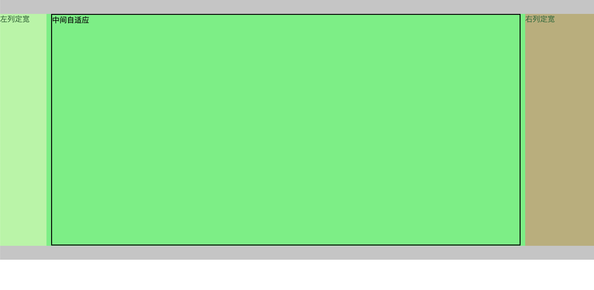
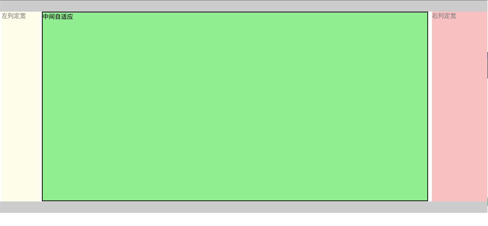
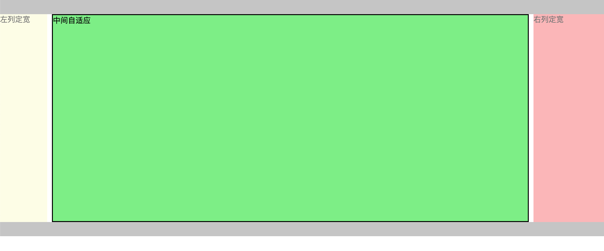

# CSS 布局

[[toc]]

参考文章：[干货!各种常见布局实现+知名网站实例分析](https://juejin.cn/post/6844903574929932301#heading-108)

## 两栏布局

### 左列定宽，右列自适应

```html
<body>
  <main>
    <div class="left">左列定宽</div>
    <div class="right">右列自适应</div>
  </main>
</body>
```

#### float + margin

```css
main {
  height: 500px;
}
.left {
  background-color: lightblue;
  float: left;
  width: 100px;
  height: 100%;
}
.right {
  height: 100%;
  background-color: lightcoral;
  margin-left: 100px; /* 大于等于 .left 的宽度 */
}
```

#### float + overflow

```css
main {
  height: 500px;
}
.left {
  float: left;
  width: 100px;
  height: 100%;
  background-color: lightblue;
}
.right {
  height: 100%;
  overflow: hidden;
  background-color: lightcoral;
}
```

#### relative + absolute

```css
main {
  height: 500px;
  position: relative;
}
.left {
  position: absolute;
  width: 100px;
  height: 100%;
  background-color: lightblue;
}
.right {
  position: absolute;
  left: 100px; /* 大于等于 .left 宽度 */
  right: 0; /* 宽度撑到最右侧 */
  height: 100%;
  background-color: lightcoral;
}
```

#### flex

```css
main {
  display: flex;
  width: 100%;
  height: 500px;
}
.left {
  width: 100px;
  background-color: lightblue;
}
.right {
  flex: 1; /* 均分父元素剩余空间 */
  background-color: lightcoral;
}
```

#### grid

```css
main {
  display: grid;
  grid-template-columns: 100px auto;
  width: 100%;
  height: 500px;
}
.left {
  background-color: lightblue;
}
.right {
  background-color: lightcoral;
}
```

### 左列自适应，右列定宽

```html
<body>
  <main>
    <div class="left">左列自适应</div>
    <div class="right">右列定宽</div>
  </main>
</body>
```

#### Float + Margin

```css
main {
  width: 100%;
  height: 500px;
}
.left {
  float: left;
  width: 100%;
  height: 100%;
  margin-right: -100px;
  background-color: lightblue;
}
.right {
  float: right;
  width: 100px;
  height: 100%;
  background-color: lightcoral;
}
```

#### Flex

```css
main {
  display: flex;
  height: 500px;
}
.left {
  flex: 1;
  background-color: lightblue;
}
.right {
  width: 100px;
  background-color: lightcoral;
}
```

#### Grid

```css
main {
  display: grid;
  grid-template-columns: auto 100px; /* auto 或 1fr */
  height: 500px;
}
.left {
  background-color: lightblue;
}
.right {
  background-color: lightcoral;
}
```

## 三栏布局

```html
<body>
  <main>
    <div class="left">左列定宽</div>
    <div class="center">左列定宽</div>
    <div class="right">右列自适应</div>
  </main>
</body>
```

### 两列定宽，一列自适应

#### float + margin 实现

```css
main {
  height: 500px;
}
.left {
  float: left;
  width: 100px;
  height: 100%;
  margin-right: 10px;
  background-color: lightblue;
}
.center {
  float: left;
  width: 200px;
  height: 100%;
  background-color: lightgreen;
}
.right {
  height: 100%;
  margin-left: 320px; /* .left 宽度 + .center 宽度 + margin */
  background-color: lightcoral;
}
```

#### float + overflow:hidden 实现

```css
main {
  height: 500px;
}
.left {
  float: left;
  width: 100px;
  height: 100%;
  margin-right: 10px;
  background-color: lightblue;
}
.center {
  float: left;
  width: 200px;
  height: 100%;
  margin-right: 10px;
  background-color: lightgreen;
}
.right {
  height: 100%;
  overflow: hidden;
  background-color: lightcoral;
}
```

> 优点：无需关注定宽的宽度，利用 BFC 达到自适应；
> 缺点：脱离文档流，需要手动清除浮动，否则会产生高度塌陷；

#### flex 实现

```css
main {
  height: 500px;
  display: flex;
}
.left {
  margin-right: 10px;
  background-color: lightblue;
}
.center {
  width: 200px;
  margin-right: 10px;
  background-color: lightgreen;
}
.right {
  flex: 1;
  background-color: lightcoral;
}
```

#### grid 实现

```css
main {
  height: 500px;
  display: grid;
  grid-template-columns: 100px 200px auto;
}
.left {
  margin-right: 10px;
  background-color: lightblue;
}
.center {
  margin-right: 10px;
  background-color: lightgreen;
}
.right {
  background-color: lightcoral;
}
```

### 两侧定宽，中间自适应

#### 双飞翼布局



```html
<body>
  <header></header>
  <main>
    <div class="center">
      <div class="inner">中间自适应</div>
    </div>
    <div class="left">左列定宽</div>
    <div class="right">右列定宽</div>
  </main>
  <footer></footer>
</body>
```

```css
header {
  height: 30px;
  background-color: #ccc;
}
main {
  height: 500px;
}
main .left {
  float: left;
  width: 100px;
  height: 100%;
  margin-left: -100%;
  opacity: 0.5;
  background-color: lightgoldenrodyellow;
}
main .center {
  float: left;
  width: 100%;
  height: 100%;
  background-color: lightgreen;
}
main .center .inner {
  height: 99%;
  border: 2px solid #000;
  margin: 0 160px 0 110px;
}
main .right {
  float: left;
  width: 150px;
  height: 100%;
  margin-left: -150px;
  opacity: 0.5;
  background-color: lightcoral;
}
footer {
  clear: both;
  height: 30px;
  background-color: #ccc;
}
```

#### 圣杯布局



```html
<body>
  <header></header>
  <main>
    <div class="center">中间自适应</div>
    <div class="left">左列定宽</div>
    <div class="right">右列定宽</div>
  </main>
  <footer></footer>
</body>
```

```css
header {
  height: 30px;
  background-color: #ccc;
}
main {
  height: 500px;
  padding: 0 160px 0 110px; /* 使 center 摆正，左右 padding = 左右栏宽度 + 间距*/
}
main .left {
  float: left;
  margin-left: -100%; /* 使 .left 上去一行 */
  position: relative;
  right: 110px; /* 相对定位调整 .left，使其居左，正值大于等于自身宽度 */
  width: 100px;
  height: 100%;
  opacity: 0.5;
  background-color: lightgoldenrodyellow;
}
main .center {
  float: left;
  width: 100%; /* 由于父元素的 padding，达到自适应 */
  height: 99%;
  border: 2px solid #000;
  background-color: lightgreen;
}
main .right {
  float: left;
  margin-left: -150px; /* 使 .right 上去一行 */
  position: relative;
  left: 160px; /* 相对定位调整 .right，使其居右，正值大于等于自身宽度 */
  width: 150px;
  height: 100%;
  opacity: 0.5;
  background-color: lightcoral;
}
footer {
  height: 30px;
  background-color: #ccc;
}
```

#### Grid 实现三栏布局



```html
<body>
  <main>
    <!-- header footer 都在内部 -->
    <header></header>
    <div class="center">中间自适应</div>
    <div class="left">左列定宽</div>
    <div class="right">右列定宽</div>
    <footer></footer>
  </main>
</body>
```

```css
main {
  height: 500px;
  display: grid;
  grid-template-columns: 100px auto 150px;
  grid-template-rows: 30px auto 30px;
  /*设置网格区域分布*/
  grid-template-areas:
    "header header header"
    "left center right"
    "footer footer footer";
}
main header {
  grid-area: header; /*指定网格区域*/
  background-color: #ccc;
}
main .left {
  grid-area: left; /*指定网格区域*/
  opacity: 0.5;
  background-color: lightgoldenrodyellow;
}
main .center {
  grid-area: center; /*指定网格区域*/
  margin: 0 10px; /* 左右间距 */
  border: 2px solid #000;
  background-color: lightgreen;
}
main .right {
  grid-area: right; /*指定网格区域*/
  opacity: 0.5;
  background-color: lightcoral;
}
main footer {
  grid-area: footer; /*指定网格区域*/
  background-color: #ccc;
}
```

## Float 相关

### 清除浮动

- 当前元素的子元素浮动后，将脱离文档流；若当前元素没有设定宽高，则子元素无法撑起父元素，导致高度塌陷；可以使用`overflow:hidden`解决高度塌陷问题；
- 在结尾处添加空标签，设置 `clear:both`，取消浮动的影响；
